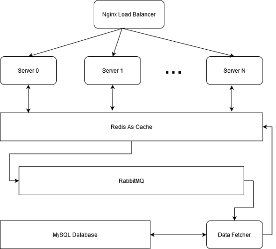

# ace-power

A simple backend server, aiming for high concurrency.

## How to run it?

First, install Python packages specified in `requirements.txt` with `pip`:

```bash
pip install -r requirements.txt
```

Then, as this program runs together with MySQL, Redis, RabbitMQ, you also need to install and configure them correctly. The simplest way is to use package managers like `apt` (if you don't mind installing outdated versions):

```bash
sudo apt update
sudo apt install mysql-server
sudo apt install redis-server
sudo apt insatll rabbitmq-server
```

After successfully installing these software, edit `config.py` to make sure you can connect to them correctly.

#### For Debugging

If everything goes well, now you can easily run this program for debugging:

```bash
uvicorn server:app --reload
```

Also, don't forget to run `consumer.py` at the same time. Otherwise,  there will be nobody to query from MySQL actually!

```bash
python consumer.py
```

#### In Production

To run it in production, you also need to install Nginx:

```bash
sudo apt install nginx
```

After installing Nginx, you may refer to `ace-power.nginx` to configure Nginx correctly. Note that in `ace-power.nginx`, 4 ace-power instances is assumed to run together for load balancing.

Then, you can simply use `ace-power.sh` to conveniently start and stop multiple ace-power instances:

```bash
# start N instances (if you didn't modify ace-power.nginx, then N == 4)
./ace-power.sh start N
# stop all instances
./ace-power.sh stop
```

Also, you need to run `consumer.py`:

```bash
python consumer.py
```

## Architecture

